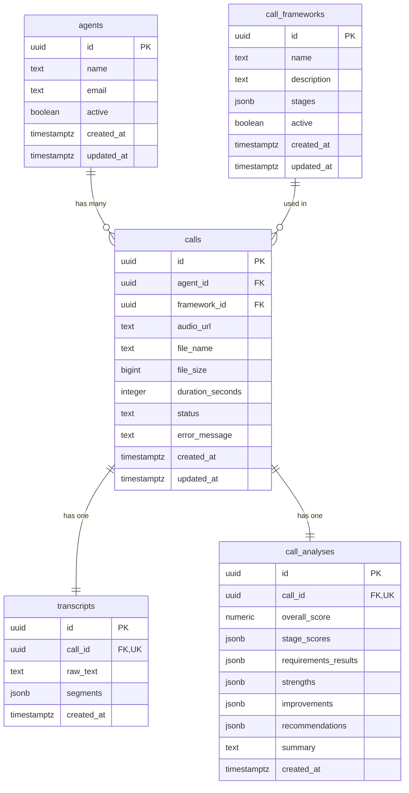

# Database Architecture & Schema Documentation

## Overview

Callsy QA (CallCoach AI) uses PostgreSQL via **Supabase** as its primary persistence and storage engine. The database architecture is designed to support high-throughput call ingestion, AI transcription, automated framework compliance analysis, and coaching feedback.

The database model balances relational integrity (for agents, frameworks, and calls) with JSONB document structures (for hierarchical stages, transcript diarization segments, and detailed AI scoring breakdowns).

---

## Entity Relationship Diagram



---

## Table Schemas

### 1. `agents`
Stores sales and appointment-setting agents whose calls are analyzed by the platform.

| Column | Type | Constraints | Description |
|---|---|---|---|
| `id` | `UUID` | `PRIMARY KEY DEFAULT gen_random_uuid()` | Unique agent identifier |
| `name` | `TEXT` | `NOT NULL` | Full name of the agent |
| `email` | `TEXT` | `NOT NULL` | Contact email address |
| `active` | `BOOLEAN` | `NOT NULL DEFAULT true` | Active status flag for agent selection |
| `created_at` | `TIMESTAMPTZ` | `NOT NULL DEFAULT now()` | Record creation timestamp |
| `updated_at` | `TIMESTAMPTZ` | `NOT NULL DEFAULT now()` | Record last updated timestamp |

---

### 2. `call_frameworks`
Defines QA evaluation frameworks composed of multiple stages and criteria requirements.

| Column | Type | Constraints | Description |
|---|---|---|---|
| `id` | `UUID` | `PRIMARY KEY DEFAULT gen_random_uuid()` | Unique framework identifier |
| `name` | `TEXT` | `NOT NULL` | Name of the framework (e.g., "Cold Calling Framework") |
| `description` | `TEXT` | `NULL` | Optional description of framework purpose |
| `stages` | `JSONB` | `NOT NULL DEFAULT '[]'::jsonb` | Array of stages, weights, and criteria requirements |
| `active` | `BOOLEAN` | `NOT NULL DEFAULT true` | Whether the framework is available for new call uploads |
| `created_at` | `TIMESTAMPTZ` | `NOT NULL DEFAULT now()` | Record creation timestamp |
| `updated_at` | `TIMESTAMPTZ` | `NOT NULL DEFAULT now()` | Record last updated timestamp |

#### `stages` JSONB Structure
```json
[
  {
    "id": "opening",
    "name": "Opening",
    "weight": 10,
    "order": 1,
    "requirements": [
      {
        "id": "req_opening_1",
        "text": "Agent introduces themselves",
        "order": 1
      },
      {
        "id": "req_opening_2",
        "text": "Agent mentions the company",
        "order": 2
      }
    ]
  }
]
```

---

### 3. `calls`
Tracks audio recordings uploaded for analysis, linked to the evaluating agent and target framework.

| Column | Type | Constraints | Description |
|---|---|---|---|
| `id` | `UUID` | `PRIMARY KEY DEFAULT gen_random_uuid()` | Unique call identifier |
| `agent_id` | `UUID` | `NOT NULL REFERENCES agents(id) ON DELETE CASCADE` | Associated agent |
| `framework_id` | `UUID` | `NOT NULL REFERENCES call_frameworks(id) ON DELETE RESTRICT` | Associated QA framework |
| `audio_url` | `TEXT` | `NOT NULL` | Path/URL to audio file in Supabase Storage |
| `file_name` | `TEXT` | `NOT NULL` | Original uploaded audio file name |
| `file_size` | `BIGINT` | `NULL` | File size in bytes |
| `duration_seconds` | `INTEGER` | `DEFAULT 0` | Audio duration in seconds |
| `status` | `TEXT` | `NOT NULL DEFAULT 'pending' CHECK (status IN ('pending', 'transcribing', 'analyzing', 'completed', 'failed'))` | Pipeline processing status |
| `error_message` | `TEXT` | `NULL` | Error details if processing failed |
| `created_at` | `TIMESTAMPTZ` | `NOT NULL DEFAULT now()` | Upload timestamp |
| `updated_at` | `TIMESTAMPTZ` | `NOT NULL DEFAULT now()` | Last update timestamp |

---

### 4. `transcripts`
Contains speech-to-text transcriptions, word-level or turn-level diarization segments, and speaker roles.

| Column | Type | Constraints | Description |
|---|---|---|---|
| `id` | `UUID` | `PRIMARY KEY DEFAULT gen_random_uuid()` | Unique transcript identifier |
| `call_id` | `UUID` | `NOT NULL UNIQUE REFERENCES calls(id) ON DELETE CASCADE` | 1-to-1 link to call |
| `raw_text` | `TEXT` | `NOT NULL` | Full plain-text transcription |
| `segments` | `JSONB` | `NOT NULL DEFAULT '[]'::jsonb` | Turn-by-turn diarized speech segments |
| `created_at` | `TIMESTAMPTZ` | `NOT NULL DEFAULT now()` | Transcription creation timestamp |

#### `segments` JSONB Structure
```json
[
  {
    "speaker": "Agent",
    "start_time": 0.0,
    "end_time": 4.5,
    "text": "Hi Alex, this is Sarah from Acme Corp. How are you today?"
  },
  {
    "speaker": "Prospect",
    "start_time": 4.8,
    "end_time": 7.1,
    "text": "I'm doing well, what is this regarding?"
  }
]
```

---

### 5. `call_analyses`
Stores AI-generated compliance evaluations, stage-by-stage scores, evidence citations, and coaching points.

| Column | Type | Constraints | Description |
|---|---|---|---|
| `id` | `UUID` | `PRIMARY KEY DEFAULT gen_random_uuid()` | Unique analysis identifier |
| `call_id` | `UUID` | `NOT NULL UNIQUE REFERENCES calls(id) ON DELETE CASCADE` | 1-to-1 link to call |
| `overall_score` | `NUMERIC(5, 2)` | `NOT NULL CHECK (overall_score >= 0 AND overall_score <= 100)` | Aggregate compliance score (0-100) |
| `stage_scores` | `JSONB` | `NOT NULL DEFAULT '[]'::jsonb` | Breakdown of scores by framework stage |
| `requirements_results` | `JSONB` | `NOT NULL DEFAULT '[]'::jsonb` | Requirement evaluation with evidence |
| `strengths` | `JSONB` | `NOT NULL DEFAULT '[]'::jsonb` | Bullet points of positive agent behaviors |
| `improvements` | `JSONB` | `NOT NULL DEFAULT '[]'::jsonb` | Areas needing improvement |
| `recommendations` | `JSONB` | `NOT NULL DEFAULT '[]'::jsonb` | Actionable coaching guidance |
| `summary` | `TEXT` | `NULL` | Executive summary of the call performance |
| `created_at` | `TIMESTAMPTZ` | `NOT NULL DEFAULT now()` | Analysis timestamp |

#### `stage_scores` JSONB Structure
```json
[
  {
    "stage_id": "opening",
    "stage_name": "Opening",
    "weight": 10,
    "score": 100,
    "max_score": 100
  },
  {
    "stage_id": "discovery",
    "stage_name": "Discovery",
    "weight": 25,
    "score": 80,
    "max_score": 100
  }
]
```

#### `requirements_results` JSONB Structure
```json
[
  {
    "requirement_id": "req_opening_1",
    "stage_id": "opening",
    "requirement_text": "Agent introduces themselves",
    "status": "PASS",
    "score": 100,
    "evidence": "Hi Alex, this is Sarah from Acme Corp.",
    "timestamp": "00:02",
    "explanation": "Agent clearly stated their full name at the beginning of the call."
  }
]
```

Status values:
- `PASS`: Requirement fully satisfied with direct transcript evidence.
- `PARTIAL`: Requirement partially fulfilled (e.g. gave name but missed company context).
- `FAIL`: Requirement was omitted or executed incorrectly.
- `NOT_APPLICABLE`: Requirement not relevant given the call's direction (e.g., immediate wrong number / gatekeeper block).

---

## Supabase Storage

### Bucket: `call-recordings`
- **Visibility**: Private (`public: false`)
- **Access Method**: Signed URLs generated via server API or authenticated client sessions.
- **Allowed MIME Types**: `audio/mpeg`, `audio/wav`, `audio/mp4`, `audio/x-m4a`, `audio/ogg`, `audio/webm`.
- **Max File Size**: 100 MB.

---

## Indexes and Constraints

| Index Name | Table | Columns | Purpose |
|---|---|---|---|
| `idx_calls_agent_id` | `calls` | `agent_id` | Fast lookup of calls by agent |
| `idx_calls_framework_id` | `calls` | `framework_id` | Fast lookup of calls by framework |
| `idx_calls_status` | `calls` | `status` | Efficient queue filtering for background workers |
| `idx_calls_created_at` | `calls` | `created_at DESC` | Recent call queries for dashboard feeds |
| `idx_transcripts_call_id` | `transcripts` | `call_id` | Fast transcript lookups per call |
| `idx_call_analyses_call_id` | `call_analyses` | `call_id` | Fast analysis report generation |

---

## Automatic Triggers

All mutable tables (`agents`, `call_frameworks`, `calls`) utilize a shared PostgreSQL trigger `update_updated_at_column()` to keep `updated_at` timestamps synchronized automatically on every `UPDATE` query.

```sql
CREATE OR REPLACE FUNCTION update_updated_at_column()
RETURNS TRIGGER AS $$
BEGIN
    NEW.updated_at = now();
    RETURN NEW;
END;
$$ LANGUAGE plpgsql;
```

---

## Seed Data

The initial migration (`20260903000001_initial_schema.sql`) automatically provisions:

1. **4 Initial Sales Agents**:
   - `Sarah Connor` (`sarah@example.com`)
   - `John Miller` (`john@example.com`)
   - `Alex Rivera` (`alex@example.com`)
   - `Emily Watson` (`emily@example.com`)

2. **Default Cold Calling Framework** (`f1000000-0000-0000-0000-000000000001`):
   - **Stage 1: Opening** (10% weight) - 4 requirements
   - **Stage 2: Discovery** (25% weight) - 3 requirements
   - **Stage 3: Qualification** (20% weight) - 3 requirements
   - **Stage 4: Offer** (15% weight) - 2 requirements
   - **Stage 5: Objection Handling** (15% weight) - 3 requirements
   - **Stage 6: Close** (15% weight) - 2 requirements
   - *Total Weight: 100%*
